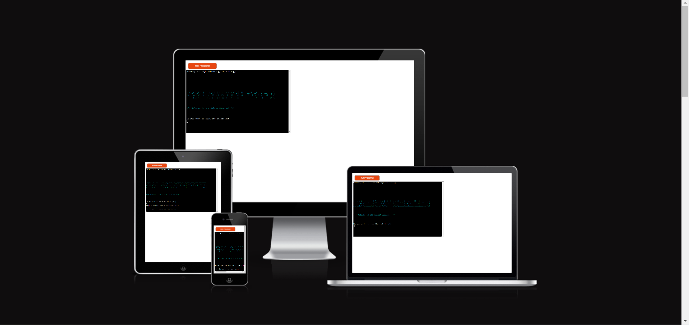
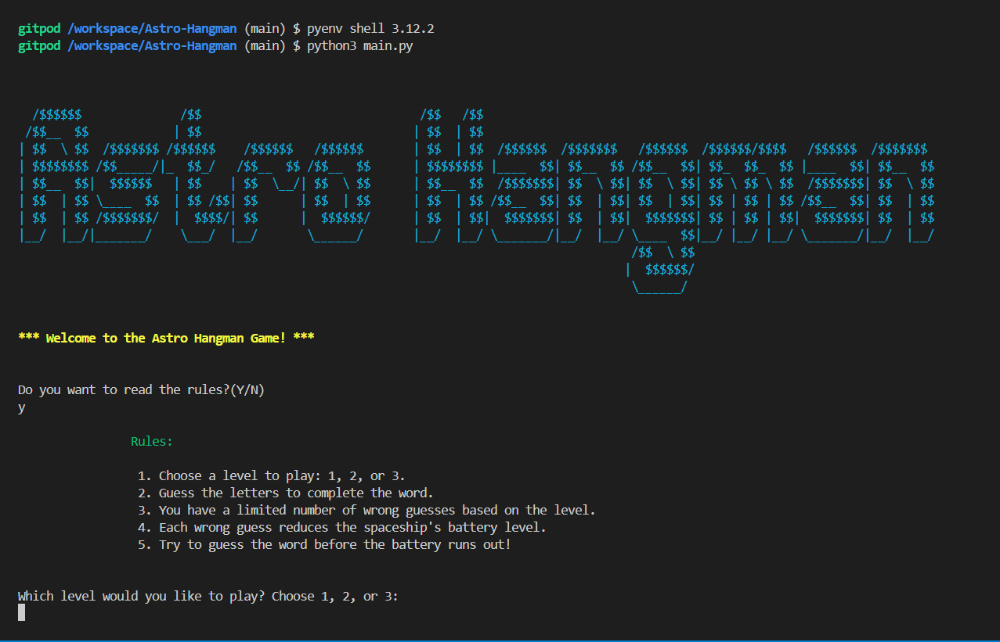
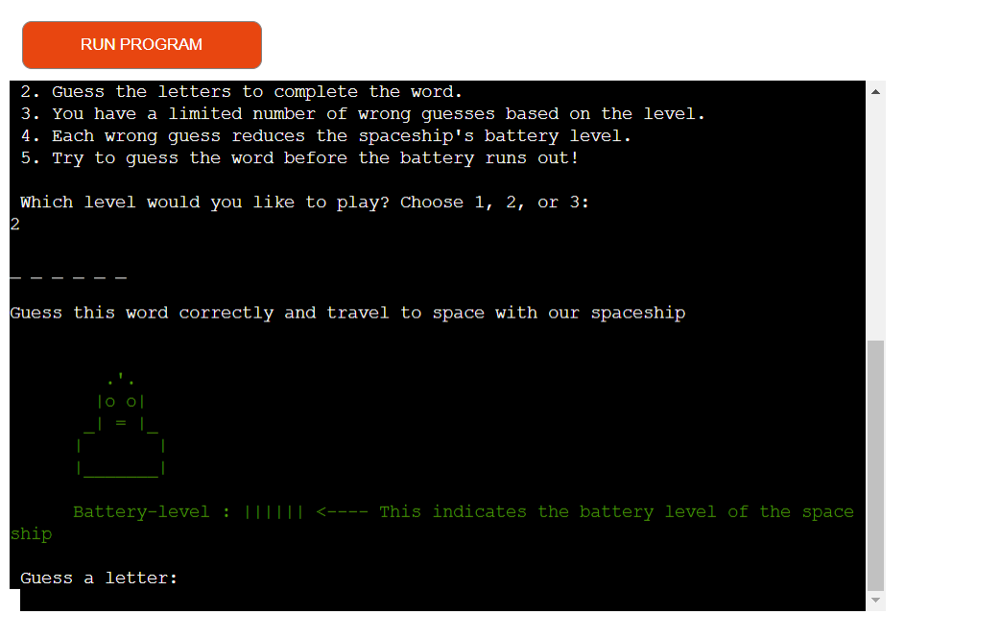
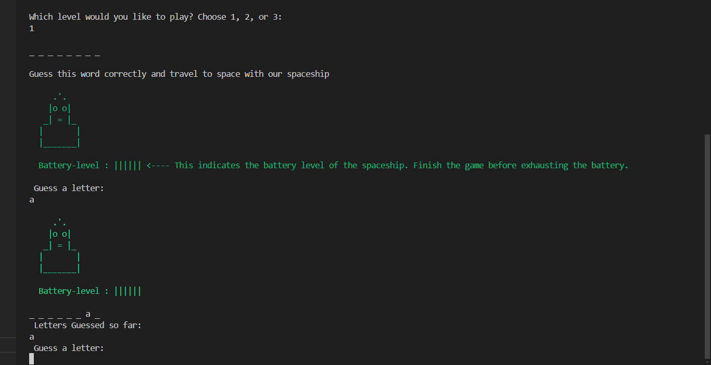
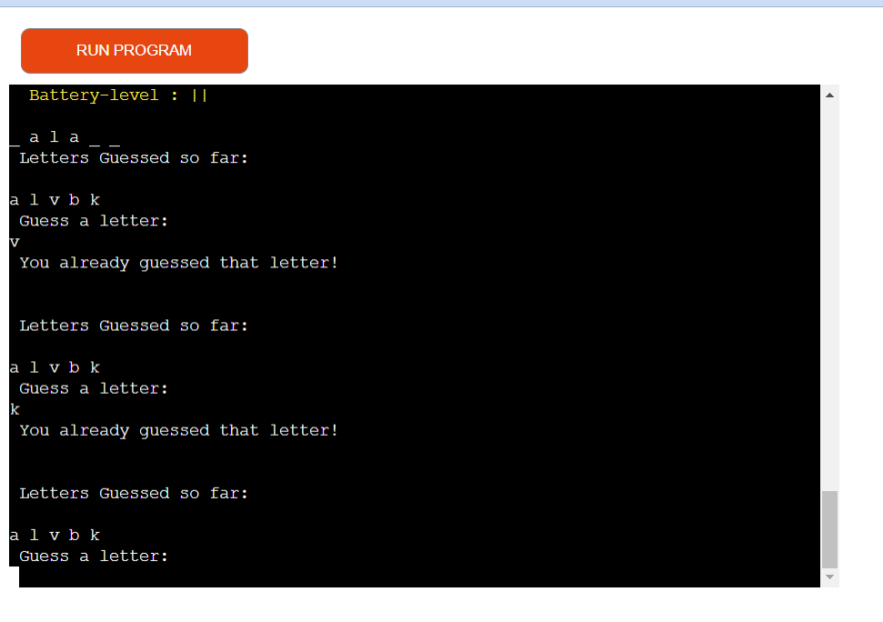
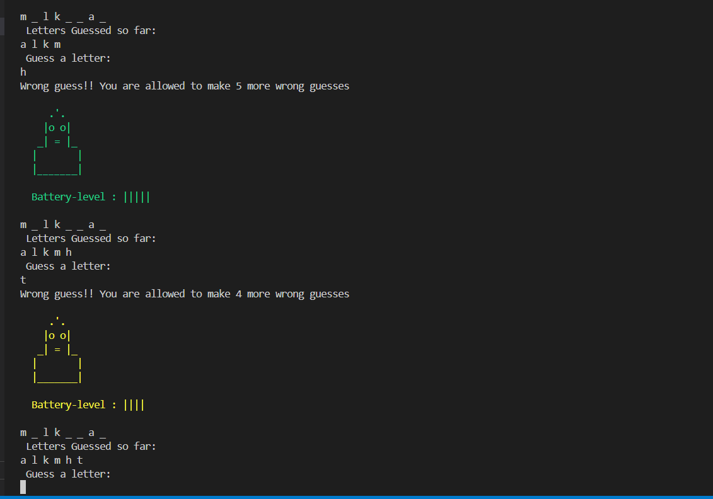
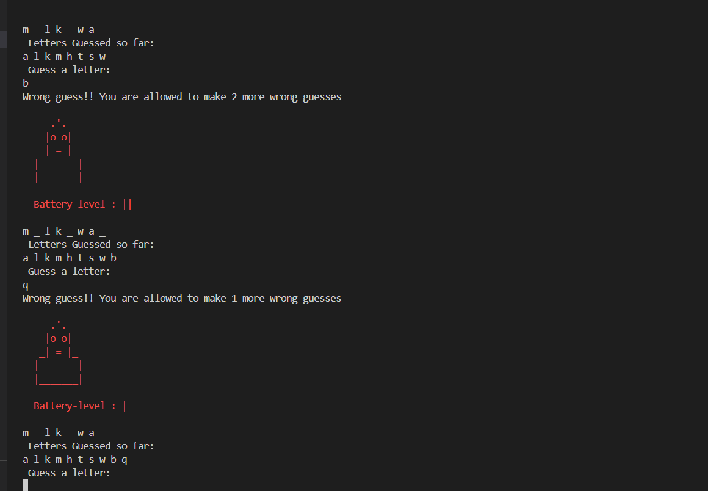
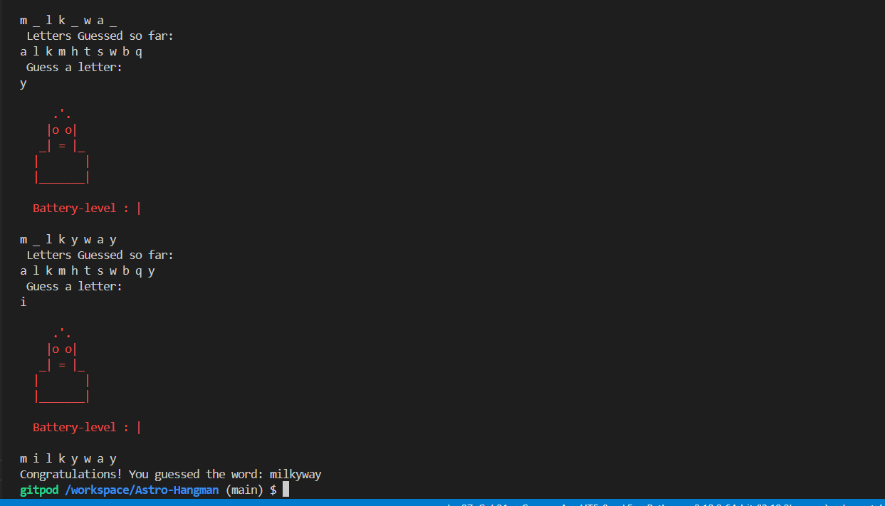
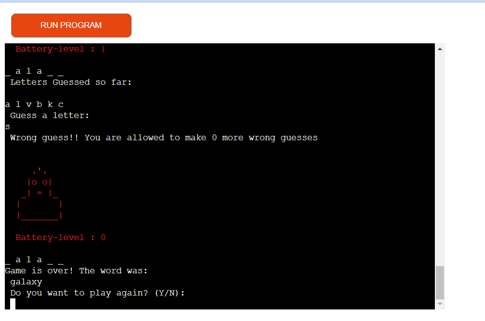

# Galaxy Guesser

### Overview
"Galaxy Guesser" is an engaging twist on the classic hangman game, offering users an opportunity to explore space-themed vocabulary. The game presents players with various levels of difficulty, each introducing new space-related words to learn. At the start, a spaceship with a full battery, indicated by a green bar, is displayed. As users make guesses and potentially make mistakes, the battery level decreases accordingly, with the color of the spaceship changing to yellow and then red as the battery depletes. This interactive experience combines gaming fun with educational value, making it an enjoyable way to expand one's knowledge of space terminology.

### - By Mouneeshwari Panneerselvam

The live version of the project can be viewed [here](https://galaxy-guesser-240640d1ad65.herokuapp.com/)

You can check out my Repository [here](https://github.com/mouneeshwarip/Galaxy-Guesser)

## Table of contents
 1. [ UX ](#ux)
	- [Site Goal](#site-goal)
	- [User Stories](#user-stories)
 2. [How to play](#how-to-play)
 2. [ Features ](#features)
 3. [ Future Feature ](#future-features)
 4. [ Technology used ](#technologies-used)
 5. [ Testing ](#testing)
	 - [Manual Testing](#manual-testing)
	 - [Validations](#validations)
 6. [ Bugs ](#bugs)
 7. [ Deployment](#deployment)
 8. [ Citation of Sources](#credits)

 ## UX

### Site Goal
The goal of our site is to provide an interactive and educational gaming experience, where users can engage with space-themed vocabulary while having fun.

### User Stories
#### As a User:
- I want to easily navigate through the website to access the Galaxy Guesser game without any confusion.
- I want clear instructions and rules provided within the game interface so that I can understand how to play the game effectively.
- I want the game to be challenging yet enjoyable, with varying difficulty levels to keep me engaged and motivated to learn new space-related words.
#### As the site administrator:
- I want to be able to build an easy app for the players to play a game.
- I want to be able to provide the necessary message for the player on every user input.

### Design

- **Colorama.Fore** used to have colored text on the terminal.
I was inspired while referring through many pp3 projects. I immediately knew, I had to add this feature to my program and did some research on the same, making my program have a better user experience.

### How to Play

- **Initial Prompt:** Players are asked if they want to play the game (Enter 'y' for yes or 'n' for no).
- **Reading the Rules:**
    - If the player chooses 'yes,' they are given an option to read the rules.
    - If they opt not to read the rules, the game proceeds directly to level selection.
- **Choosing Levels:**Players can choose from three difficulty levels: 1, 2, or 3.
- Level 1: Maximum of 6 wrong guesses allowed.
- Level 2: Maximum of 5 wrong guesses allowed.
- Level 3: Maximum of 4 wrong guesses allowed.
- **Gameplay**:
  - A random word with blank spaces appears, prompting the user to guess letters.
  - Correct guesses display the letters in place, while incorrect guesses decrease the battery level.
  - The spaceship starts with a green full battery.
  - For every two wrong guesses, the battery level decreases:
  - Green (full battery)
  - Yellow (mid-level battery)
  - Red (low battery)
- **Winning and Losing**:
  - Players win by correctly guessing the entire word.
  - The game ends when the maximum number of wrong guesses is reached or the correct word is guessed, depending on the chosen level.

  [Back to top](#table-of-contents)

  ## Features

- At the start of the game - Welcomes the player and prompts to enter y/n to read the rules.

- Asks player to choose which level he/she wants to play.

- Initially game displays the spaceship with green full battery level .

- If the letter is typed and the letter is in the hidden word, the hidden word is updated and displayed.

- Along with the hidden word, guessed letters are displayed and the number of remaining attempts is displayed.

- If the letter is not in the word or if the letter is repeated, the number of attempts is reduced by 1 and the next stage is shown with all the updated details.

- When the number of remaining attempts becomes zero, the game ends displaying the text you lost in ASCII art with the hidden letter.

- If player have found the word, game ends displaying the text you Win in ASCII art with the hidden letter.

- players can choose to play again or quit.

## Future Features
Due to time constraints, I wasn't able to add these features, but I would like to add in the future.

   -  **Score System**:
      1. Implement a scoring system to track player performance.
      2. Points awarded for correct guesses and successfully completing a word.
      3. Bonus points for completing levels with fewer wrong guesses.
   -  **Hints**:
      1. Introduce a hint system to assist players in guessing the word.
      2. Players can use hints, which will reveal a random letter in the word.
      3. Limit the number of hints available per game to maintain challenge.

[Back to top](#table-of-contents)

## Technologies Used

- **Git** Used to version control throughout my project and to ensure that a clean record is maintained.
- **GitHub**  Used to store the project's code after being pushed from Git
- **Heroku** Used to deploy the live project
- **GitPod** Used as an Integrated Development Environment for building this website.

 **Languages Used**
- Python

**Python Packages/ Libraries Used**
I used the following libraries and modules:
- Random: (choice) returns a random word from a list of words.
- Colorama: (Fore) to apply different color to texts.

[Back to top](#table-of-contents)

