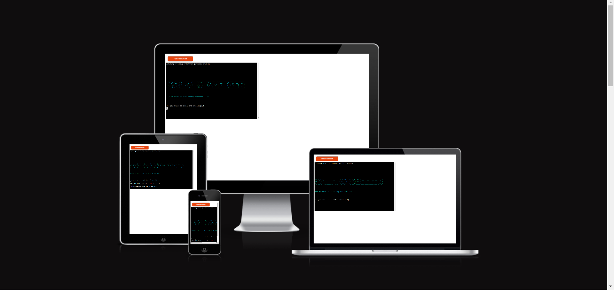
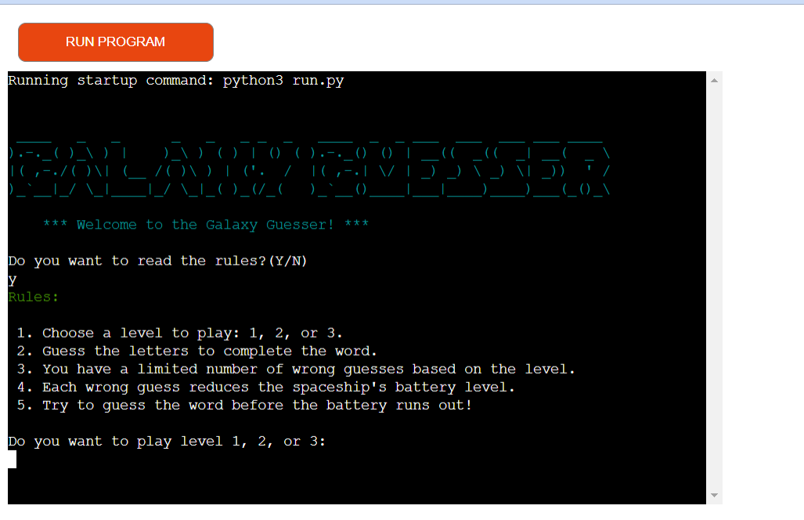
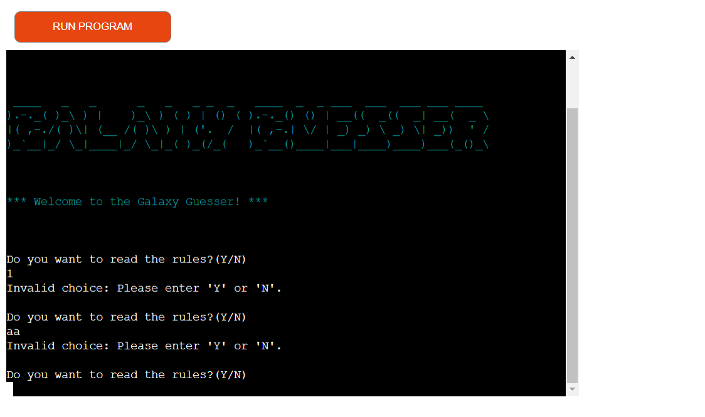
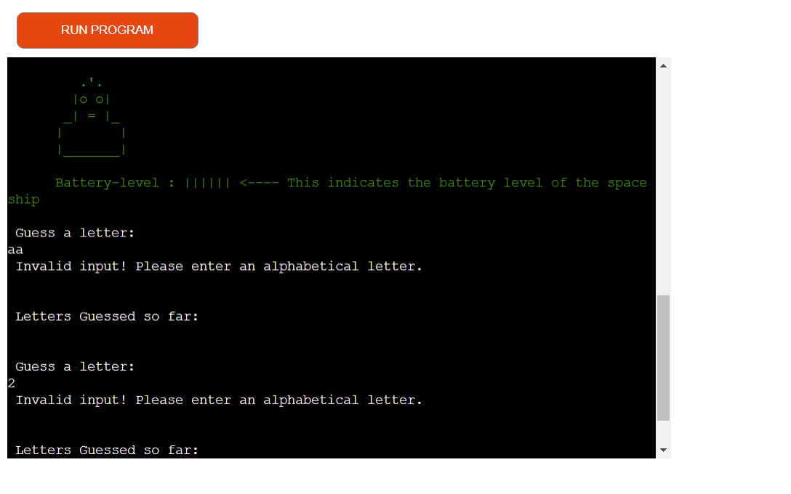
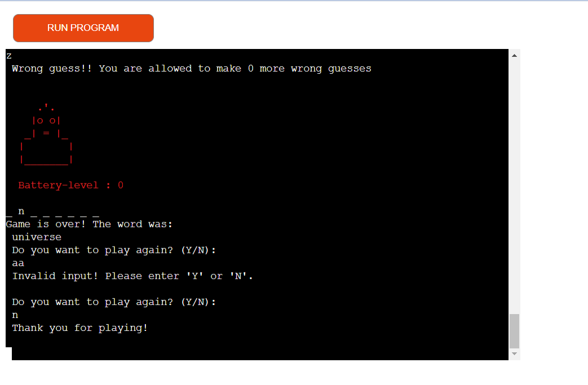
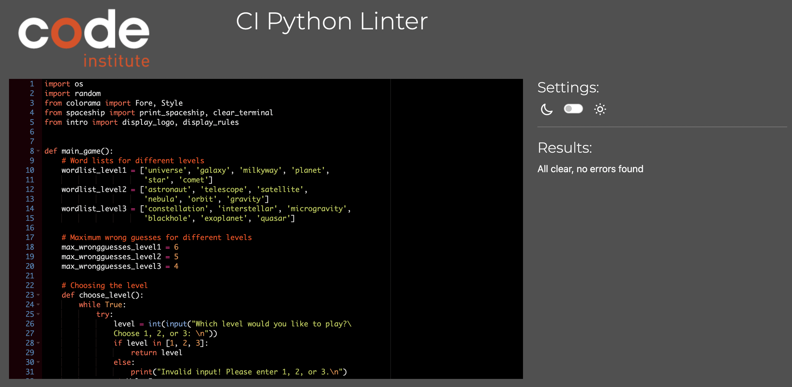
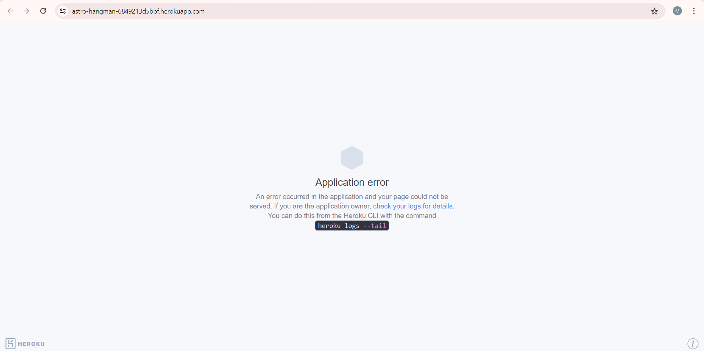

# Galaxy Guesser

### Overview
"Galaxy Guesser" is an engaging twist on the classic hangman game, offering users an opportunity to explore space-themed vocabulary. The game presents players with various levels of difficulty, each introducing new space-related words to learn. At the start, a spaceship with a full battery, indicated by a green bar, is displayed. As users make guesses and potentially make mistakes, the battery level decreases accordingly, with the color of the spaceship changing to yellow and then red as the battery depletes. This interactive experience combines gaming fun with educational value, making it an enjoyable way to expand one's knowledge of space terminology.

### - By Mouneeshwari Panneerselvam

The live version of the project can be viewed [here](https://galaxy-guesser-240640d1ad65.herokuapp.com/)

You can check out my Repository [here](https://github.com/mouneeshwarip/Galaxy-Guesser)

## Table of contents
 1. [ UX ](#ux)
	- [Site Goal](#site-goal)
	- [User Stories](#user-stories)
 2. [How to play](#how-to-play)
 2. [ Features ](#features)
 3. [ Future Feature ](#future-features)
 4. [ Technology used ](#technologies-used)
 5. [ Testing ](#testing)
	 - [Manual Testing](#manual-testing)
	 - [Validations](#validations)
 6. [ Bugs ](#bugs)
 7. [ Deployment](#deployment)
 8. [ Citation of Sources](#credits)

 ## UX

### Site Goal
The goal of our site is to provide an interactive and educational gaming experience, where users can engage with space-themed vocabulary while having fun.

### User Stories
#### As a User:
- I want to easily navigate through the website to access the Galaxy Guesser game without any confusion.
- I want clear instructions and rules provided within the game interface so that I can understand how to play the game effectively.
- I want the game to be challenging yet enjoyable, with varying difficulty levels to keep me engaged and motivated to learn new space-related words.
#### As the site administrator:
- I want to be able to build an easy app for the players to play a game.
- I want to be able to provide the necessary message for the player on every user input.

### Design

- **Colorama.Fore** used to have colored text on the terminal.
I was inspired while referring through many pp3 projects. I immediately knew, I had to add this feature to my program and did some research on the same, making my program have a better user experience.

### How to Play

- **Initial Prompt:** Players are asked if they want to play the game (Enter 'y' for yes or 'n' for no).
- **Reading the Rules:**
    - If the player chooses 'yes,' they are given an option to read the rules.
    - If they opt not to read the rules, the game proceeds directly to level selection.
- **Choosing Levels:**Players can choose from three difficulty levels: 1, 2, or 3.
- Level 1: Maximum of 6 wrong guesses allowed.
- Level 2: Maximum of 5 wrong guesses allowed.
- Level 3: Maximum of 4 wrong guesses allowed.
- **Gameplay**:
  - A random word with blank spaces appears, prompting the user to guess letters.
  - Correct guesses display the letters in place, while incorrect guesses decrease the battery level.
  - The spaceship starts with a green full battery.
  - For every two wrong guesses, the battery level decreases:
  - Green (full battery)
  - Yellow (mid-level battery)
  - Red (low battery)
- **Winning and Losing**:
  - Players win by correctly guessing the entire word.
  - The game ends when the maximum number of wrong guesses is reached or the correct word is guessed, depending on the chosen level.

  [Back to top](#table-of-contents)

  ## Features

- At the start of the game - Welcomes the player and prompts to enter y/n to read the rules.

- Asks player to choose which level he/she wants to play.

- Initially game displays the spaceship with green full battery level .

- If the letter is typed and the letter is in the hidden word, the hidden word is updated and displayed.

- Along with the hidden word, guessed letters are displayed and the number of remaining attempts is displayed.

- If the letter is not in the word, the number of attempts is reduced by 1 and the next stage is shown with all the updated details.

- If the letter has already been guessed, a prompt is shown for the same and the user is asked to guess again without any reduction in the attempts.

- When the number of remaining attempts becomes zero, the game ends displaying the text you lost in ASCII art with the hidden letter.

- If player has guessed the hidden word, game ends congratulating the player with a message.

- If player has not guessed the word, game ends with a GAME OVER message and displaying the hidden word.

- players can choose to play again or quit.

## Future Features
Some future additions to the game could be the following:

   -  **Score System**:
      1. Implement a scoring system to track player performance.
      2. Points awarded for correct guesses and successfully completing a word.
      3. Bonus points for completing levels with fewer wrong guesses.
   -  **Hints**:
      1. Introduce a hint system to assist players in guessing the word.
      2. Players can use hints, which will reveal a random letter in the word.
      3. Limit the number of hints available per game to maintain challenge.

[Back to top](#table-of-contents)

## Technologies Used

- **Git** Used to version control throughout my project and to ensure that a clean record is maintained.
- **GitHub**  Used to store the project's code after being pushed from Git
- **Heroku** Used to deploy the live project
- **GitPod** Used as an Integrated Development Environment for building this website.

 **Languages Used**
- Python

**Python Packages/ Libraries Used**
I used the following libraries and modules:
- Random: (choice) returns a random word from a list of words.
- Colorama: (Fore) to apply different color to texts.

[Back to top](#table-of-contents)

## Testing

The code has been tested multiple times on the local terminal and on the Heroku site.

| Input  | Status |
|--|--|
|Player can choose if rules are to be viewed or not | True |
|Game rules are displayed or skipped with respective to player choice  | True |
|Player receiving a response if guessed letter was not an alphabet | True |
|If a player gives a non-alphabetical input, invalid input message will be displayed | True |
|Spaceship turns yellow, if the number of attempts remaining are mid-level | True |
|Spaceship turns red, if the number of attemps are low | True |
|Player can view result - Won / Lost and the secret word | True |
|Player can play again | True |
|Player can quit the game | True |

- When a number, same letter or word with special characters is given, it is invalid.

- when player gives any input apart from y or n, player is prompted with invalid choice.

- When player gives any input apart from y or n, player is prompted with invalid choice.

- When the player runs out of the max number of attempts, then the game ends.

- When the player gives N for play again, Thank you for playing.

#### Validations

Used [CI Python Linter](https://pep8ci.herokuapp.com/) to validate if all the Python files follow the PEP8 style guide. 

No errors were found.

[Back to top](#table-of-contents)

## Bugs

### Solved bugs:
1. **Deployment Error:** Encountered an application error while deploying to Heroku. Resolved it by connecting to Heroku CLI and troubleshooting with application logs, following advice from Stack Overflow.
  
  

2. I ran the code on CI Python Linter tool and corrected it as per the PEP8 style guide.

3. **Commit Message Error:**Added an incorrect commit message. Resolved this issue by using git reset --hard HEAD~1 followed by git push --force, a solution I learned from a YouTube tutorial.

4. **Repository and Template Issues:**Incorrect Repository Setup: Initially created the project without the correct Python template package, leading to deployment issues. Resolved this by creating a new repository with the appropriate template and rectifying the error at the last moment.

### Unfixed Bugs:
No known bugs.

[Back to top](#table-of-contents)

## Deployment

This project is deployed on Heroku.

1. Login to [Heroku](https://id.heroku.com/login) or create a account.
2. On the main page, click the button labeled as New and from the drop-down menu select create New App.
3. Please enter a unique app name.
4. Select your region and click on Create App button
5. Within your page, navigate to settings tab
6. Scroll down to view the Config Vars section and click Reveal Config Vars.
7. Enter port into the Key box and 8000 into the Value box and click the Add button.
8. Next, scroll down to Buildpacks sections. Click Add buildpack and select python.
9. Within the same section, click Add buildpack and select nodejs. Note it has to be in order, first will be python and then nodejs.
10. Scroll up and navigate to Deploy tab.
11. Select Github as the deployment method
12. Search for the repository name and click the connect button
13. Scroll to the bottom of the deploy page and select the preferred deployment type
14. Click either Enable Automatic Deploys for automatic deployment when you push updates to Github or Manual deploy to deploy the current state of the branch you choose. I have used the manual method.

[Back to top](#table-of-contents)

## Credits
### Content and resources
1. Code Institute
	- Course content for the portfolio project3 helped greatly in understanding the need to complete the project.
	- The Love Sandwich project helped me understand various requirements from python point of view.
2. W3 School
	- Used to reference python related methods.
3. stackoverflow
	- Used to refer some python related workaround.
4. ChatGpt 
  - Helped me understand the types of issues I faced and provided guidance on resolving them effectively.  
7. ASCII art websites to generate the logo and stages.
8. Slack channels

### Acknowledgements

I would like to extend my heartfelt gratitude to the following people for their invaluable support and contributions to the success of this project:

- My Mentor(Can Sucullu): For providing incredible last-minute corrections and tips that significantly improved the project.
- Cohort Facilitator(Krystina): For consistently supplying the resources I needed and sharing insightful pep talks that kept me motivated.
- My Friend(Priyanka) and Colleagues: For being my last-minute saviors with great tips and hacks, ensuring I could tackle challenges effectively.
- My Husband(Bala): The real pillar behind my project's submission. I am immensely grateful for his unwavering support, staying awake with me through sleepless nights and helping me understand the complex logics.

*****************
[Back to top](#table-of-contents)

